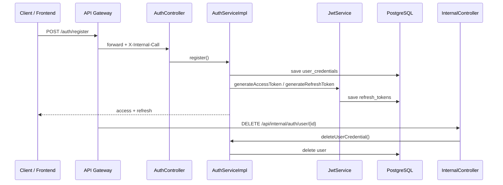
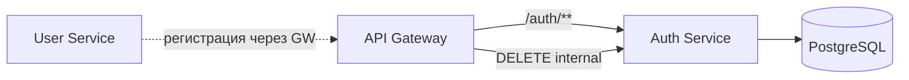

# Auth Service

Микросервис аутентификации и авторизации в распределённой системе. Сервис регистрирует пользователей, выдаёт JWT access/refresh токены (RS256), хранит refresh-токены в PostgreSQL и предоставляет внутренний API для каскадного удаления учётных данных при удалении пользователя.

---

## Содержание

- [Назначение](#назначение)
- [Архитектура](#архитектура)
- [Паттерны](#паттерны)
- [Технологический стек](#технологический-стек)
- [Потоки данных](#потоки-данных)
- [REST API](#rest-api)
- [JWT и refresh-токены](#jwt-и-refresh-токены)
- [Хранилище данных](#хранилище-данных)
- [Безопасность](#безопасность)
- [Метрики и мониторинг](#метрики-и-мониторинг)
- [Профили и конфигурация](#профили-и-конфигурация)
- [Запуск](#запуск)
- [Тестирование](#тестирование)
- [Структура проекта](#структура-проекта)
- [Интеграция с другими сервисами](#интеграция-с-другими-сервисами)

---

## Назначение

Auth Service выполняет следующие задачи:

1. **Регистрация** — создание учётной записи с хешированием пароля (BCrypt).
2. **Аутентификация** — login по email/password, выдача пары access + refresh JWT.
3. **Обновление токенов** — rotation refresh-токена с сохранением в БД.
4. **Валидация JWT** — проверка подписи и срока действия access-токена.
5. **Внутреннее удаление** — `DELETE /api/internal/auth/user/{id}` для Gateway при каскадном удалении пользователя.

---

## Архитектура



---

## Паттерны

| Паттерн | Где используется | Описание |
|---------|------------------|----------|
| **Stateless Security** | `SecurityConfig` | JWT без server-side session |
| **Gateway Auth Filter** | `GatewayAuthFilter` | Парсинг JWT из запросов Gateway в `SecurityContext` |
| **Repository** | JPA repositories | Абстракция доступа к PostgreSQL |
| **DTO Mapping** | MapStruct `UserCredentialMapper` | Request ↔ Entity |
| **Centralized Error Handling** | `GlobalAdvice` + `ErrorItem` | Единый формат ошибок |
| **Profile-based Config** | `application-{dev,prod}.properties` | Разделение локальной и production конфигурации |

---

## Технологический стек

| Категория | Технология |
|-----------|------------|
| Язык | Java 21 |
| Framework | Spring Boot 3.3.4 |
| Безопасность | Spring Security, JWT (jjwt, RS256) |
| SQL БД | PostgreSQL 42.7 + Spring Data JPA |
| Миграции | Liquibase |
| Маппинг | MapStruct 1.6 |
| Документация API | SpringDoc OpenAPI 3 |
| Метрики | Micrometer + Prometheus (Actuator) |
| Логирование | Logback + Logstash JSON Encoder |
| Общие библиотеки | `common-filters-starter` (GitHub Packages) |
| Контейнеризация | Docker (multi-stage build) |
| Тесты | JUnit 5, Mockito, Testcontainers |

---

## Потоки данных

### Регистрация и login

1. Клиент отправляет `UserRegistrationRequest` или `AuthRequest` на `/auth/register` или `/auth/login`.
2. `AuthServiceImpl` проверяет email, хеширует пароль, сохраняет `UserCredential`.
3. `JwtService` генерирует access (15m) и refresh (1d) токены с claim `roles`.
4. Refresh-токен сохраняется/обновляется в таблице `refresh_tokens`.

### Refresh

1. Клиент отправляет `RefreshTokenRequest` на `/auth/refresh`.
2. Сервис извлекает username и roles из refresh JWT, удаляет старую запись, выдаёт новую пару токенов.

### Запросы через Gateway

1. Gateway добавляет заголовки `X-Internal-Call: true`, `X-Source-Service: gateway`, `Authorization: Bearer ...`.
2. `GatewayAuthFilter` парсит JWT payload (без повторной проверки подписи — Gateway уже проверил) и устанавливает `SecurityContext`.

---

## REST API

Базовый путь: `/auth`

| Метод | Путь | Auth | Описание |
|-------|------|------|----------|
| `POST` | `/register` | Public | Регистрация пользователя |
| `POST` | `/login` | Public | Аутентификация |
| `POST` | `/refresh` | Public | Обновление токенов |
| `POST` | `/validate?token=` | Authenticated | Проверка JWT |
| `DELETE` | `/api/internal/auth/user/{id}` | Internal header | Удаление credentials и refresh-токена (только Gateway) |

**Swagger UI (через Gateway):** [http://localhost:8080/swagger-ui.html](http://localhost:8080/swagger-ui.html)

**Swagger UI (напрямую):** [http://localhost:8081/swagger-ui.html](http://localhost:8081/swagger-ui.html)

---

## JWT и refresh-токены

| Параметр | Значение |
|----------|----------|
| Алгоритм | RS256 |
| Ключи | `classpath:keys/private.pem`, `public.pem` |
| Access TTL | `jwt.expiration=15m` |
| Refresh TTL | `jwt.refresh-expiration=1d` |
| Claims | `sub` (email), `roles` |

### Таблица `refresh_tokens`

| Колонка | Описание |
|---------|----------|
| `token_id` | PK |
| `user_email` | Email пользователя (unique per user) |
| `refresh_token` | JWT refresh token |
| `issued_at`, `expires_at` | Время жизни |

---

## Хранилище данных

### Таблица `user_credentials`

| Колонка | Описание |
|---------|----------|
| `id` | PK |
| `email` | Unique, case-insensitive lookup |
| `password` | BCrypt hash |
| `name`, `surname`, `birth_date` | Профиль |
| `role` | `USER` / `ADMIN` |

Миграции: `src/main/resources/db/changelog/`.

---

## Безопасность

- **Публичные эндпоинты:** `/auth/login`, `/auth/register`, `/auth/refresh`, `/actuator/**`.
- **GatewayAuthFilter** — аутентификация для запросов от API Gateway.
- **Internal API** — `X-Internal-Call: true` в `InternalController`.
- **Custom 401/403 handlers** — JSON-ответы для Spring Security.
- **Authorities** — единый формат `ROLE_USER` / `ROLE_ADMIN` в `UserCredential.getAuthorities()` и JWT claim `roles`.
- **Registration** — поле `role` опционально, по умолчанию `USER`.
- **Удаление пользователя** — `deleteUserCredential` в одной транзакции удаляет `user_credentials` и связанные `refresh_tokens`.

---

## Метрики и мониторинг

Эндпоинты: `/actuator/health`, `/actuator/prometheus`, `/actuator/metrics`.

---

## Профили и конфигурация

| Профиль | Файл | Назначение |
|---------|------|------------|
| default + `dev` | `application.properties` + `application-dev.properties` | Локальная разработка |
| `prod` | `application-prod.properties` | Production (Docker/K8s) |
| `test` | `application-test.properties` | Тесты |

Общие настройки (порт, JWT, OpenAPI, Actuator, Liquibase changelog, `spring.jpa.hibernate.ddl-auto=validate`) — в `application.properties`.  
Окружение-специфичные (URL БД, credentials) — в profile-файлах.

> Схема БД управляется **только Liquibase**. Hibernate в dev/prod работает в режиме `validate` (не `update`).

---

## Запуск

### Требования

- Java 21, Maven 3.9+
- PostgreSQL (локально или Docker)
- GitHub Packages token (для `common-filters-starter`)

### Локально (dev)

```bash
mvn spring-boot:run -Dspring-boot.run.profiles=dev
```

### Docker

```bash
docker build -t authservice .
docker run -p 8081:8081 authservice
```

Профиль `prod` активируется в Dockerfile.

---

## Тестирование

```bash
mvn test
```

> Integration-тесты с Testcontainers требуют **Docker**.

### Структура тестов

```
src/test/java/com/mymicroservice/authservice/
├── unit/                    # Mockito, @WebMvcTest
│   ├── advice/
│   ├── controller/
│   ├── filter/
│   ├── mapper/
│   ├── model/
│   ├── security/
│   ├── service/
│   └── util/
├── integration/             # Testcontainers, @SpringBootTest
│   ├── repository/
│   └── service/
├── configuration/           # AbstractContainerTest
└── util/
    ├── data/TestConstants.java
    ├── UserCredentialGenerator.java
    ├── RefreshTokenGenerator.java
    └── AuthRequestGenerator.java
```

### Стиль именования

```
<имяМетода>_Should<Ожидание>_When<Условие>
```

Примеры:
- `register_ShouldReturnAuthResponse_WhenUserIsNew`
- `doFilter_ShouldSetSecurityContext_WhenGatewayCallHasValidJwt`
- `fullAuthFlow_ShouldCompleteSuccessfully_WhenCredentialsAreValid`

---

## Структура проекта

```
authservice/
├── src/main/java/.../authservice/
│   ├── controller/       # AuthController, InternalController
│   ├── service/          # AuthService, JwtService
│   ├── filter/           # GatewayAuthFilter
│   ├── configuration/    # SecurityConfig, OpenApiConfig
│   ├── model/            # UserCredential, RefreshToken, Role
│   └── repositiry/       # JPA repositories
├── src/main/resources/
│   ├── application.properties
│   ├── application-dev.properties
│   ├── application-prod.properties
│   ├── keys/             # RSA keys
│   └── db/changelog/
└── src/test/java/.../authservice/
    ├── unit/
    ├── integration/
    ├── configuration/
    └── util/
```

---

## Интеграция с другими сервисами



| Сервис | Направление | Протокол |
|--------|-------------|----------|
| API Gateway | → Auth Service | REST `/auth/**`, internal delete |
| Auth Service | ← Gateway | JWT + trace headers |

---

## Лицензия

Учебный / демонстрационный проект @juliakaiko.
